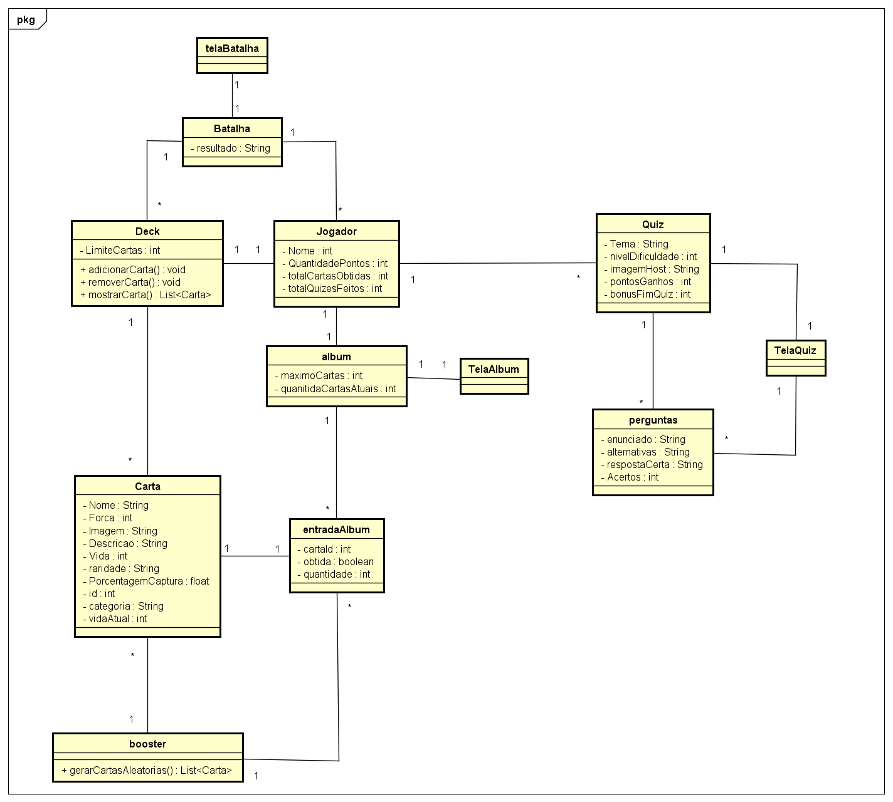
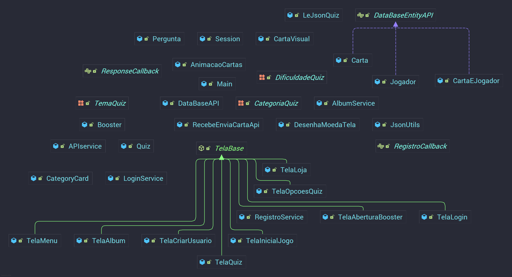

# 🎴 Lendas Históricas

## 🧭 Resumo
Desenvolvido pelos alunos **Mateus Cardoso** e **Gabriel Saueressig** para a disciplina de **Paradigmas de Programação** do curso de Sistemas de informação UFSM, 
o Lendas Históricas nasceu de um hobby em comum: a paixão por colecionar cartas de Pokémon e o interesse por figuras históricas.

A proposta central é implementar um sistema gamificado de resposta a perguntas, ele permite que os jogadores escolham a área do conhecimento e a dificuldade dos quizzes, 
recebendo perguntas aleatórias dentro desses critérios. Durante os quizzes, os usuários receberão feedback sobre suas respostas e acumularão pontos proporcionais à dificuldade escolhida. 
Esses pontos poderão ser trocados por boosters de cartas, que representam personagens históricos e terão 3 tipos de raridades diferentes, cada uma com uma arte única e probabilidades 
diferentes. As cartas obtidas serão armazenadas em um álbum virtual, registrando tanto as cartas desbloqueadas quanto as que ainda não foram adquiridas. 
Os jogadores poderão selecionar cartas para montar um deck ativo, que poderá ser utilizado em um sistema de batalha, previsto para desenvolvimento futuro, 
assim como uma versão para Android caso haja tempo. 
Todos os dados essenciais, incluindo pontos e cartas serão armazenados em um banco de dados, garantindo persistência e acompanhamento do progresso do jogador. 
A interface do sistema será visual e intuitiva, proporcionando uma experiência gamificada motivadora, com efeitos e feedback constantes durante o jogo.

---

## ⚙️ Desenvolvimento
O projeto foi desenvolvido **majoritariamente em Java**, utilizando a biblioteca **LibGDX** para o desenvolvimento do jogo.  
Além disso, foi implementada uma **API em Python**, responsável por gerir as informações de um banco de dados **SQLite**, através de requisições **GET** e **POST**.

Buscou-se seguir princípios de **Programação Orientada a Objetos (POO)** e aplicar uma metodologia ágil inspirada no **Extreme Programming (XP)**, priorizando ciclos curtos 
de implementação, testes e melhorias constantes, além de um grande uso da técnica de **Pair Programming**.

---

## 🃏 Cartas
A arte das cartas foi uma das primeiras preocupações da equipe, já que nenhum dos integrantes possuía grande experiência em design gráfico.  
A solução encontrada foi **dividir a criação das imagens em duas frentes**:

- 🤖 **Geração por IA**: utilizada em cartas especiais de conjunto, onde duas figuras históricas interagem entre si.
- 🖼️ **Imagens do Pinterest**: adotadas para cartas comuns, explorando estilos variados de ilustração.

Para definir quais personalidades seriam retratadas, contamos com a ajuda do **ChatGPT**, que gerou listas com nomes de grandes figuras em diferentes áreas do conhecimento humano.

### Formatação de Imagens
Outro desafio técnico enfrentado durante o desenvolvimento envolveu o formato das imagens das cartas. Após a remoção do fundo original, as imagens ficaram com uma área 
transparente significativa ao redor delas, o que causava problemas na formatação e no posicionamento correto das cartas na interface do projeto.

Esse problema foi particularmente difícil de identificar inicialmente, pois o espaço transparente não era visualmente óbvio. 
No entanto, uma vez detectada a causa raiz, a solução foi relativamente simples: removemos completamente o espaço transparente excedente através de um processo de **recorte** das imagens,
ajustando-as para conter apenas a área útil da carta.

---

## 🌱 Primeiros Passos

A primeira ação no desenvolvimento foi a **criação de um diagrama de classes de domínio**.  
Logo percebemos que — seja por **falta de experiência** ou por **ansiedade em começar a programar** — o diagrama **não representava fielmente a realidade do projeto**.

Durante a implementação, diversas mudanças surgiram:
- 🧩 **Atributos** foram adicionados ou removidos;
- 🔁 **Lógicas internas** foram completamente alteradas;
- 🗑️ **Classes inteiras** foram removidas, enquanto outras foram criadas do zero.

Mesmo assim, o diagrama cumpriu um papel fundamental: serviu **como guia e referência estrutural** para o restante do desenvolvimento, ajudando a organizar o raciocínio sobre a 
arquitetura do jogo.

O primeiro código concreto escrito foi o das **classes base**, como `Jogador`, `Carta` e outras entidades essenciais para dar forma ao *Historical TCG*.

### Diagrama Feito antes de Começar o Projeto

### Diagrama Feito após o Término do Projeto

### Diagrama Completo


---

## 🗄️ Banco de Dados

Essa foi nossa **primeira grande dificuldade** no projeto.  
A ideia inicial era utilizar o **SQLite** diretamente no jogo — o que funcionou perfeitamente nas versões **Desktop** e **Mobile**.

Porém, surgiu um grande obstáculo: ao exportar o projeto para **Web**, o LibGDX converte o código Java para **JavaScript**, e o SQLite **não é compatível** com essa tradução.

### 💭 Primeiras Tentativas
Nosso primeiro pensamento foi criar **dois códigos diferentes**, um para cada versão (Desktop e Web).  
Mas, para manter o projeto **simples, coeso e sustentável**, decidimos **buscar uma solução única**.

A alternativa seguinte foi tentar usar o **WebAssembly (WASM)** para converter os dados do banco e armazená-los em cache no navegador.  
Levamos essa ideia adiante por vários dias, testando diferentes geradores e implementações, mas enfrentamos **diversos erros** e não conseguimos fazê-la funcionar corretamente 
no ambiente Web.

### 🌐 A Solução: API Python
Após muita experimentação, adotamos uma abordagem mais robusta: a criação de uma **API** hospedada em [PyAnyWhere](https://www.pythonanywhere.com/). 
Essa API, escrita em **Python Flask**, recebe requisições **GET** e **POST** do jogo e as traduz em comandos SQL para o banco **SQLite**. 
Os dados trafegam no formato **JSON**, o que nos permitiu **abstrair o acesso direto ao banco de dados** e tornar o código **totalmente multiplataforma** —
funcionando de forma idêntica em **Web, Desktop e Mobile**.
Essa solução não apenas resolveu o problema, mas também tornou o sistema mais **modular, seguro e escalável**.

### Código python para inserção de jogador na API:
```python
@app.route('/api/jogador/insert', methods=['POST', 'OPTIONS'])
def insert_jogador():
    if request.method == 'OPTIONS':
        return '', 200  

    data = request.get_json()
    nome = data.get('nome')
    senha = data.get('senha')

    if not nome or not senha:
        return jsonify({"erro": "nome e senha são obrigatórios"}), 400

    conn = get_db_connection()
    cursor = conn.cursor()
    cursor.execute(
        'INSERT INTO jogador (nome, senha) VALUES (?, ?)',
        (nome, senha)
    )
    conn.commit()
    jogador_id = cursor.lastrowid
    conn.close()

    return jsonify({"status": "ok", "id": jogador_id})
```

### Interface Java para objetos que relacionam-se com a API:
```java
public interface DataBaseEntityAPI {
    JsonValue toJson();
    JsonValue toJsonKey();

    void fromJson(JsonValue json);
    void setId(int id);
    int getId();
}
```

### SQL e Comunicação com a API

Durante o desenvolvimento do projeto, enfrentamos desafios significativos relacionados ao SQL e à comunicação com a API, que exigiram soluções criativas e aprendizado além do
conteúdo visto em aula.

#### Latência na Comunicação

A comunicação entre o código e a API não é instantânea, há um delay de alguns segundos entre o envio da requisição, o processamento no servidor e o retorno da resposta. 
Embora esse tempo seja relativamente curto, ele criou problemas estruturais importantes no código.
Por exemplo, não era possível exibir as cartas na tela se o servidor ainda não tivesse retornado todas elas. Para resolver isso, precisamos implementar conceitos de programação 
assíncrona que não haviam sido abordados em aula, como **Callbacks** e **sincronização de threads**. Essas técnicas nos permitiram aguardar a resposta da API antes de prosseguir 
com a renderização das cartas, garantindo a consistência dos dados exibidos.

O aprendizado destas técnicas foi feito atravez de pesquisa em fóruns e de perguntas ativas à IA, entendendo o funcionamento e chegando a esta solução:

```java
receberCarta.receberCartaApi(carta, novaCarta -> {
    synchronized (cartasBooster) {
        cartasBooster.add(novaCarta);

        if (cartasBooster.size() == cartasEsperadas && callback != null) {
            callback.onBoosterCompleto(new ArrayList<>(cartasBooster));
        }
    }
});
```

#### A Importância de um Comando SQL Bem Estruturado

Outro desafio enfrentado foi a comunicação frequente com o banco de dados. Em determinada etapa do projeto, era necessário verificar se o jogador já possuía uma carta específica: 
caso já tivesse, o sistema deveria atualizar a quantidade; caso contrário, deveria adicionar um novo registro na tabela.
Inicialmente, implementamos três funções separadas: `verificaCarta()`, `updateCarta()` e `adicionaCarta()`. Essa abordagem exigia verificações constantes nos resultados retornados pelo
banco de dados, aumentava a complexidade do código e gerava diversos bugs difíceis de rastrear e corrigir.

Foi então que compreendemos a verdadeira importância de um **código SQL bem otimizado**. Ao refatorar a lógica, descobrimos que era possível realizar toda essa operação diretamente no Servidor, gerando um único endpoint que se comunica com o banco de dados diretamente. 
A migração dessa lógica para o servidor simplificou drasticamente o sistema e gerou múltiplos benefícios:

1. Performance Aprimorada: Eliminação de múltiplas consultas e da latência de rede associada.

2. Código Simplificado: Remoção da necessidade de funções auxiliares e do gerenciamento complexo de callbacks assíncronos nesta parte da aplicação.


---

## 🖌️ Desenvolvimento de Interface e Uso de IA

### Classe Base para Reutilização de Código

No início do desenvolvimento, foi percebida uma grande repetição de código entre as diferentes telas do jogo. Para solucionar isso, foi criada a classe **`TelaBase`** que estende `Screen` e implementa a maioria dos métodos padrão do LibGDX (`show()`, `render()`, `resize()`, `dispose()`, etc.). 

Essa classe foi extendida por todas as outras telas do projeto, reduzindo significativamente a duplicação de código e facilitando a manutenção.

A classe `TelaBase` faz coisas como: botar um fundo padrão para todas as telas, e implementar o render e resize padrão da LibGdx.

### IA como Ferramenta de Aprendizado e Estilização

Durante o desenvolvimento, foi utilizada inteligência artificial para compreender o funcionamento do sistema de telas do LibGDX, especialmente conceitos como:

- Ciclo de vida das telas (`show()`, `render()`, `resize()`, `dispose()`)
- Sistema de Stage e Actors
- Organização com Tables e Layouts

### Processo de Criação das Interfaces

Toda a estilização visual das telas foi desenvolvida com auxílio de IA, que gerava a estrutura base dos layouts, componentes UI e estilos visuais. E então era adicionado a lógica funcional, incluindo:
- Event listeners dos botões
- Chamadas de funções de outras classes
- Integração com o banco de dados
- Gerenciamento de estados do jogo
- Navegação entre telas

Esse fluxo de trabalho permitiu focar na lógica de negócio enquanto a IA acelerava a criação da interface, resultando em telas visualmente consistentes e funcionalmente robustas.

---

## 🧠 Quiz

O Quiz é o principal meio de interação educacional do jogo.
Ele desafia os jogadores com perguntas de diferentes áreas do conhecimento, organizadas por níveis de dificuldade (fácil, médio e difícil).
As questões abrangem desde conteúdos fundamentais e de ensino médio até tópicos avançados de programação, permitindo que o jogador aprenda e revise enquanto se diverte.
Além disso, o sistema pode ser utilizado como uma ferramenta de preparo para o ENEM ou como revisão para provas escolares.

Todas as perguntas e respostas estão armazenadas em um arquivo JSON, gerado com o auxílio do ChatGPT para garantir diversidade e quantidade de questões.
Durante o jogo, as perguntas são sorteadas conforme o progresso e desempenho do jogador.
Cada acerto no quiz recompensa o jogador com pontos de troca — quanto mais difícil a questão, mais pontos conquistados.
Dessa forma, o quiz une aprendizado e colecionismo, transformando o estudo em uma experiência gamificada e divertida.

---

## 🔠 Fontes

### O Desafio

Implementar fontes customizadas no LibGDX foi mais complicado do que esperado. LibGDX não trabalha diretamente com arquivos `.ttf` - é necessário converter para o formato `.fnt` usando ferramentas como o **Hiero** (ferramenta recomendada pelo próprio LibGdx), que gera um arquivo `.fnt` e um `.png`.

Além disso, ajustar tamanhos de fonte é trabalhoso: não é possível simplesmente mudar o tamanho usando o próprio código, é preciso gerar múltiplas versões da fonte em tamanhos diferentes ou usar `setFontScale()`, que pode deixar o texto borrado. Neste projeto por exemplo, foi necessário gerar dois arquivos `.fnt` com seus `.png` adequados, um para textos grandes e outro para textos menores.

### Erros Cometidos

#### Modificar o Estilo Original da Skin

Em alguns casos, eu precisava adicionar suporte a acentos em componentes que já vinham estilizados pela Skin padrão, como o `TextField` (input de texto). O problema era que criar um novo estilo apenas para mudar a fonte destruía completamente a estilização visual do componente, perdia cores, bordas, padding e outros detalhes.

**Tentativa:**
```java
TextField.TextFieldStyle customStyle = new TextField.TextFieldStyle(
    skin.get(TextField.TextFieldStyle.class)
);
customStyle.font = fonteComAcentos;
TextField input = new TextField("", customStyle);
// Resultado: input completamente desconfigurado
```

**Problema não resolvido:** No fim, não consegui corrigir este problema, principalmente no input de "Usuário", tanto pela falta de tempo quanto pela dificuldade em replicar toda a estilização manualmente.

**Solução adotada:** Simplesmente mudei o texto de "Usuário" para "Username", evitando o acento.


#### Limitações com Emojis e Unicode

Quando a fonte é gerada usando o Hiero, ele oferece apenas conjuntos de caracteres limitados como **Latin Extended** ou **ASCII**. Gerar uma fonte com suporte completo a Unicode (incluindo emojis) resulta em arquivos extremamente grandes e tempos de carregamento inviáveis.

Isso dificultou a utilização de emojis como forma rápida de adicionar ícones e estilização visual aos textos (📚, 🎯, 🛒), algo que seria muito prático para melhorar a interface.

---

## 🎵 Músicas

Uma experiência particularmente criativa do projeto foi a produção das músicas utilizadas no jogo. O processo envolveu um trabalho colaborativo que começou com discussões sobre músicas
que apreciávamos. A partir dessas referências, tocamos elas em um teclado MIDI com **voices personalizadas** (timbres customizados). 
Após a gravação dos áudios, utilizamos os recursos de áudio da biblioteca **LibGDX** para integrar as músicas ao jogo, garantindo qualidade sonora e sincronização adequada com 
os diferentes momentos da gameplay.

A biblioteca LibGDX oferece funções prontas e fáceis de usar para a implementação de diferentes músicas em diversas telas do jogo. A classe Music é ideal para faixas longas de áudio que não precisam ser carregadas totalmente na memória, como músicas de fundo.

O seguinte bloco de código ilustra a inicialização e a configuração da música de fundo na fase de criação (create) do jogo:

```java

public static Music musicaFundo;

public void create() {
    // 1. Carrega o arquivo de áudio.
    musicaFundo = Gdx.audio.newMusic(Gdx.files.internal("Audio/priscilaViolao.ogg"));
    
    // 2. Configura a reprodução (loop e volume).
    musicaFundo.setLooping(true); // Repete infinitamente
    musicaFundo.setVolume(1f);     // Volume máximo (1.0)

    // 3. Inicia a reprodução.
    musicaFundo.play();
    
    // Define a tela inicial.
    setScreen(new TelaMenu(Main.this));
}

```

Sempre que é necessário trocar a música de fundo (por exemplo, ao mudar de tela), a prática recomendada é parar a música atual, liberar seus recursos da memória e, em seguida, carregar a nova faixa. evitando o consumo desnecessário de memória e a sobreposição de áudios.

```java

// Verifica se há uma música tocando
if (Main.musicaFundo != null) {
    // 1. Para a música atual.
    Main.musicaFundo.stop();
    // 2. Libera os recursos de memória.
    Main.musicaFundo.dispose();
}

// 3. Carrega e inicia a nova música (substituindo a anterior).
Main.musicaFundo = Gdx.audio.newMusic(Gdx.files.internal("Audio/priscilaViolao.ogg"));

```
---

## Possíveis Melhorias


O projeto teve várias idealizações que não puderam ser implementadas a tempo devido ao prazo limitado, como:

### 1. Sistema de Batalha Multijogador em Tempo Real
Utilizar os recursos de **WebSocket** da biblioteca LibGDX para implementar batalhas PvP (Player vs Player) em tempo real.

### 2. Versão Mobile para Android
Adaptar o jogo para a plataforma Android, aproveitando a compatibilidade multiplataforma nativa do LibGDX. Isso expandiria significativamente o público-alvo, tornando o jogo mais acessível e portátil.


Além das funcionalidades inicialmente planejadas, identificamos melhorias que podem agregar valor ao projeto em versões futuras:

### 3. Sistema de Ranking e Leaderboards
Implementar um sistema de classificação global onde jogadores possam comparar seus pontos, estatísticas e conquistas, incentivando a competitividade e o engajamento contínuo.

### 4. Expansão de Conteúdo - Novas Categorias e Níveis
Ampliar o banco de perguntas com novas categorias, temas e dificuldades.

### 5. Sistema de Conquistas
Adicionar conquistas desbloqueáveis que recompensem jogadores por atingir marcos específicos (vencer X batalhas, completar categorias, acumular pontos), incentivando a exploração completa das funcionalidades do jogo.

### 6. Aprimoramento de Animações e Efeitos Visuais
Implementar animações mais fluidas durante as batalhas, adicionar efeitos de partículas para acertos/erros, melhorar transições entre telas e criar feedback visual mais rico para as ações do jogador.

### 7. Sistema de Troca de Cartas entre Jogadores
Permitir que jogadores troquem cartas entre si através de um sistema de trade.

### 8. Sistema de Áudio Dinâmico e Contextual
Expandir o sistema de áudio com músicas que se adaptam dinamicamente ao contexto do jogo (menu principal, preparação para batalha, combate ativo, vitória/derrota), além de adicionar efeitos sonoros responsivos para todas as ações do jogador, aumentando a imersão.

---

## 🚀 Execução

### 🔧 Orientações
Requer constante conexão com a internet para funcionar corretamente.

### ▶️ Vídeo
Há um vídeo da execução em web disponível [aqui](https://www.youtube.com/watch?v=YXsPFa4iCvw).

---

## 📘 Referências

### 🤖 Inteligência Artificial
- [ChatGPT](https://chatgpt.com/)
- [Claude](https://claude.ai/)
- [Gemini](https://gemini.google.com/)

Além do já creditado nas secções devidas, as inteligências artificiais foram utilizadas durante o desenvolvimento do projeto para auxílio em:
- 🔧 refatoração
- 📝 formatação do README (apenas formatação, sem gerar conteúdo)
- 🐞 resolução de erros

Alguns prompts utilizados:
- “botão de voltar não funciona”
- “Como melhorar o visual de um trabalho que usa libgdx…”
- “preciso que melhore mto a visualização da carta, mas sem mudar a lógica…”
- “me ajude a modularizar”
- "Como utilzar Callbacks e Syncronized"
- "Porque as imagens parecem mau formatadas"
- "Como mexer com Json em uma aplicação java usando LibGdx"

### 🎨 Imagens
É devido creditar também os diversos artistas que criaram as imagens utilizadas no jogo, as seguintes cartas têm imagem retirada de variadas fontes:

#### Comum
- [Abraham Lincoln](https://pin.it/2lwU8pQv4)
- [Alan Turing](https://pin.it/1xcxG4fJh)
- [Alexander Graham Bell](https://www.cruzeirodovale.com.br/entretenimento/qual-e-a-historia-da-criacao-do-telefone-/)
- [Alexandre o Grande](https://pin.it/4Rul0ofKE)
- [Aristóteles](https://pt.everand.com/book/591106959/A-POESIA-SEGUNDO-ARISTOTELES-FILOSOFIA)
- [Bach](https://pt.wikipedia.org/wiki/Ludwig_van_Beethoven)
- [Charles Babbage](https://pt.wikipedia.org/wiki/Charles_Babbage)
- [Charles Darwing](https://biologiaterceironutricao.blogspot.com/2018/11/biografia-de-charles-darwin.html)
- [Churchill](https://kinnu.xyz/kinnuverse/history/cold-war/origins-and-lineage-factors-leading-to-the-cold-war/)
- [Claude Shannon](https://pt.wikipedia.org/wiki/Claude_Shannon)
- [Christopher Columbus](https://pt.wikipedia.org/wiki/Ficheiro:Portrait_of_a_Man,_Said_to_be_Christopher_Columbus.jpg)
- [Confucio](https://podcasts.apple.com/us/podcast/%E7%AC%AC74%E7%AB%A0-%E6%8A%B1%E7%93%AE%E8%80%81%E4%BA%BA%E5%A6%82%E6%98%AF%E8%AF%B4/id1690289268?i=1000617716152&l=pt-BR)
- [Danti Alighieri](https://www.instagram.com/reel/DFJKITfPe1H/)
- [Einstein](https://pin.it/5wjsKCgyv)
- [Euclides](https://jaquelinejk.wordpress.com/indice-biografico/)
- [Galilei](https://pt.quizur.com/trivia/desafio-de-conhecimento-geral-TDMq)
- [Gandhi](https://pin.it/42eIslrjP)
- [Gaus](https://ancestors.familysearch.org/pt/LZPZ-B3B/johann-carl-friedrich-gauss-1777-1855)
- [Geoarge Washingtong](https://www.imdb.com/pt/name/nm6141957/)
- [Gutenberg](https://se.pinterest.com/pin/552042866845000385/)
- [Júlio Cesar](https://www.reddit.com/r/totalwar/comments/14ykzig/happy_birthday_to_julius_caesar/?tl=pt-br)
- [Kant](https://ar.pinterest.com/pin/711428072424351263/)
- [Marx](https://br.pinterest.com/pin/691654455300645595/)
- [Pasteur](https://www.instagram.com/reel/DEFQB4kROas/)
- [Mandela](https://www.estadao.com.br/acervo/mandela-o-redentor-de-um-povo/)
- [Marie Curie](https://www.facebook.com/photo.php?fbid=837499988589335&id=100069880237905&set=a.394178189588186)
- [Faraday](https://fotokita.grid.id/read/112858886/jawaban-apakah-tulisanmu-di-paragraf-pertama-telah-memenuhi-kriteria)
- [Michelangelo](https://pt.pinterest.com/xliana46/)
- [Miguel de Cervantes](https://www.mercadolibre.com.ar/cartel-chapa-decorativo-don-quijote--a5/up/MLAU1416567638)
- [Mozart](https://br.pinterest.com/pin/733734964315390547/)
- [Napoleon](https://br.pinterest.com/pin/68745733748/)
- [Newton](https://www.youtube.com/shorts/lo1jHFnLWLo)
- [Nietzsche](https://br.pinterest.com/pin/35395547064282776/)
- [Pascal](https://blogdocastorp.blogspot.com/2014/08/blaise-pascal-beleza-verdade-e-outros.html)
- [Pitágoras](https://web.facebook.com/Roadofscintst/?_rdc=1&_rdr#)
- [Platão](https://edukavita.blogspot.com/2013/07/escultura-grega-antiga-ciencia-grega.html)
- [Raphael Sanzio](https://problemasfilosoficos.blogspot.com/2008/06/histria-da-filosofia-exegese-e.html)
- [Descartes](https://pt.quizur.com/trivia/voce-sabe-tudo-sobre-rene-descartes-1rbBP)
- [Rousseau](https://www.topmelhores.com.br/cultura/220-os-10-filosofos-mais-importantes-da-historia)
- [Shakespeare](https://knigavuhe.org/book/sonety-izbrannoe/)
- [Socrates](https://thestandupphilosophers.co.uk/the-platonic-realm-of-carl-jung/)
- [Tesla](https://br.pinterest.com/pin/92746073570879458/)
- [Hobbes](https://www.meisterdrucke.pt/impressoes-artisticas-sofisticadas/John-Michael-Wright/625947/Retrato-de-Thomas-Hobbes,-1669-70.html)
- [VanGogh](https://encrypted-tbn1.gstatic.com/images?q=tbn:ANd9GcR8-QIh7TTytmv58htYVLK3DlReiO-Ss8rwwSGOmXYMwej6iXOW)
- [Voltaire](https://www.migalhas.com.br/pilulas/397168/bau-migalheiro)
- [Von Neumann](https://webresearchit.wordpress.com/2014/08/06/biografie-del-passato-di-uomini-del-futuro-john-von-neumann/)

#### Rara
- [Abraham Lincoln](https://pin.it/2lwU8pQv4)
- [Alexandre o Grande](https://pin.it/6ce4M8i5n)
- [Charles Darwin](https://br.pinterest.com/pin/272327108714675333/)
- [Churchill](https://br.pinterest.com/pin/83879611803584726/)
- [Cleopatra](https://sk.pinterest.com/pin/535013630805535696/)
- [Cristovão Colombo](https://www.hortencioleilao.com/peca.asp?ID=16344004)
- [Galilei](https://br.pinterest.com/pin/914934480557949712/)
- [George Washingtong](https://br.pinterest.com/pin/377598750016123654/)
- [Júlio Ceasar](https://cl.pinterest.com/pin/1150599404811347804/)
- [Kant](https://br.pinterest.com/pin/597149231886250794/)
- [Mandela](https://br.pinterest.com/pin/572731277607709782/)
- [Nietzsche](https://br.pinterest.com/pin/99923685477955165/)
- [Rousseau](https://www.amazon.com.br/Las-enso%C3%B1aciones-del-paseante-solitario/dp/8491044868)
- [Hobbes](https://mundoeducacao.uol.com.br/historiageral/estado-moderno.htm)
- [Voltaire](https://in.pinterest.com/pin/724727765073979280/)

- O Restante das cartas raras foram feitas com o uso de IA
#### Ultra Rara
- Todas geradas por IA

### 🎵 Músicas
As músicas utilizadas como base foram [The Witcher 3 Soundtrack OST - Priscilla's Song](https://www.youtube.com/watch?v=2bSk-8C76dc) e [Pokemon Fire Red Version Intro](https://www.youtube.com/watch?v=XBmgAp_PlgI).

Para solicitar qualquer alteração de referência e/ou inclusão de novas referências favor entrar em contato com o autor.
